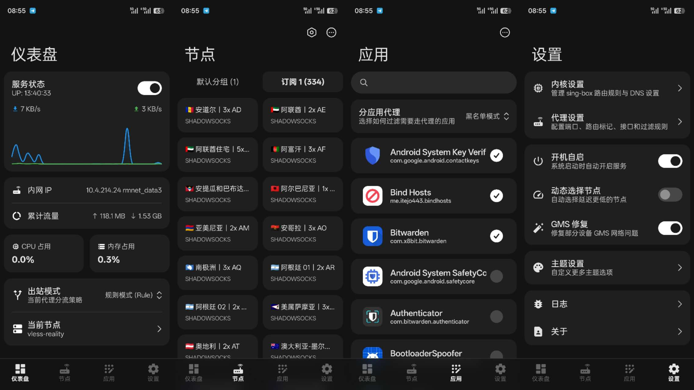

<p align="center">
  
</p>

<h1 align="center">NetProxy</h1>

<p align="center">
  <strong>Android 系统级 sing-box 透明代理模块</strong><br>
  支持 eBPF、TCP / UDP、分应用代理、节点订阅与 Clash API
</p>

<p align="center">
  <a href="https://github.com/Fanju6/NetProxy-Magisk/releases">
    
  </a>
  <a href="https://github.com/Fanju6/NetProxy-Magisk/releases">
    
  </a>
  
</p>

<p align="center">
  <a href="https://github.com/Fanju6/NetProxy-Magisk/releases">下载模块</a> ·
  <a href="https://www.netproxy.store/">使用文档</a> ·
  <a href="https://play.google.com/store/apps/details?id=com.fanjv.netproxy">Android 管理器</a> ·
  <a href="https://t.me/NetProxy_Magisk">Telegram</a>
</p>

<p align="center">
  中文 | <a href="README_EN.md">English</a>
</p>

---

## 项目简介

NetProxy 是面向已 Root Android 设备的系统级透明代理模块。模块以内置 sing-box 为代理核心，通过 cgroup 与 TC eBPF 接管系统及共享网络流量，并提供 Android 管理器、CLI 与 zashboard 三种管理入口。

支持 **Magisk、KernelSU 与 APatch**。节点、订阅、路由、DNS 和透明代理配置均保存在模块目录中，不依赖 VPN 模式运行。

## 管理入口

| 入口 | 适合场景 |
|------|----------|
| [**Android 管理器**](https://play.google.com/store/apps/details?id=com.fanjv.netproxy) | 日常使用，管理服务、节点、订阅、分应用代理、配置与日志 |
| **CLI** | 终端操作、自动化和故障排查 |
| **Clash API + zashboard** | 查看代理组、连接与延迟，进行运行时控制 |

Clash API 默认配置：

- Controller：`http://<设备IP>:9999`
- zashboard：`http://<设备IP>:9999/ui/`
- Secret：`singbox`

控制器默认监听所有网络接口，请仅在可信网络中使用，并按需修改访问密钥。

## 界面预览

<div align="center">
  
</div>

## 核心能力

- 使用 cgroup eBPF 接管本机 TCP、UDP 与 DNS 流量
- 无需 TUN 设备，也不修改 iptables、nftables 或策略路由
- 分应用黑名单 / 白名单、热点和 USB 共享代理
- 单节点链接、节点文件、Clash YAML 与订阅导入
- 手动节点选择与 URLTest 自动测速
- Rule、Global、Direct 出站模式
- 按 WiFi SSID 在基础模式与 Direct 之间自动切换
- Clash API、zashboard、连接管理与节点测速
- 订阅定时更新和规则集提前绕过
- 自动清理 eBPF 程序、Map 与 TC 挂载

## 安装

Release 页面提供以下两个版本：

| 版本 | 文件名 | 包含内容 | 适用设备 |
|------|--------|----------|----------|
| **完整版** | `NetProxy_<版本>_<构建号>.zip` | sing-box、Proxylink、zashboard 与 Android 管理器 APK | 默认推荐，可在刷入时安装配套管理器 |
| **Lite 包** | `NetProxy_<版本>_<构建号>_lite.zip` | 与完整版相同的代理核心、CLI、eBPF 和 zashboard，不内置 Android 管理器 APK | 已从 Google Play 安装管理器，或只使用 CLI / zashboard 的用户 |

两个版本的代理能力完全一致。如果希望刷入模块时一并安装管理器，请选择**完整版**；Lite 用户仍可从 Google Play 安装管理器。

> [!IMPORTANT]
> eBPF 入站需要内核启用 BPF、cgroup v2 与 cgroup socket attach 能力。热点共享还需要可用的 TC eBPF 支持；不满足要求的内核无法启动本版本。

1. 从 [Releases](https://github.com/Fanju6/NetProxy-Magisk/releases) 下载最新模块 ZIP。
2. 在 Magisk、KernelSU 或 APatch 中刷入模块。
3. 按安装提示选择内置管理器或 Google Play 版本，然后重启设备。
4. 导入并选择节点，再通过管理器或 CLI 启动服务。

模块默认 `AUTO_START=0`。确认节点与配置可用后，可在管理器中启用开机启动，或将 `config/module.conf` 中的 `AUTO_START` 改为 `1`。

## 快速开始

以下命令均需要 Root 权限。

```sh
# 查看服务状态
su -c '/data/adb/modules/netproxy/scripts/cli service status'

# 导入单个节点链接
su -c '/data/adb/modules/netproxy/scripts/cli node add "vless://..."'

# 导入节点文本或 Clash YAML
su -c '/data/adb/modules/netproxy/scripts/cli node import /sdcard/clash.yaml'

# 查看并选择节点
su -c '/data/adb/modules/netproxy/scripts/cli node list'
su -c '/data/adb/modules/netproxy/scripts/cli node use 节点名称'

# 启动服务
su -c '/data/adb/modules/netproxy/scripts/cli service start'

# 查看或切换出站模式
su -c '/data/adb/modules/netproxy/scripts/cli mode'
su -c '/data/adb/modules/netproxy/scripts/cli mode rule'

# 查看 zashboard 地址
su -c '/data/adb/modules/netproxy/scripts/cli api ui'
```

添加订阅：

```sh
su -c '/data/adb/modules/netproxy/scripts/cli sub add 我的订阅 https://example.com/sub'
su -c '/data/adb/modules/netproxy/scripts/cli sub update 我的订阅'
su -c '/data/adb/modules/netproxy/scripts/cli sub auto on'
```

## 节点配置格式

推荐使用 Android 管理器或 CLI 导入节点。Proxylink 会把单链接、节点文件、Clash YAML 和订阅转换为模块需要的 sing-box 配置片段。

### 手写节点文件

手写节点文件必须是一个完整的 sing-box 配置片段，顶层使用 `outbounds` 数组。不能直接把单个 outbound 对象作为文件根节点。

下面是 SOCKS5 节点示例：

```json
{
  "outbounds": [
    {
      "type": "socks",
      "tag": "fr-socks",
      "server": "proxy.example.com",
      "server_port": 1080,
      "version": "5",
      "username": "user",
      "password": "password"
    }
  ]
}
```

将节点文件放在：

```text
/data/adb/modules/netproxy/config/singbox/outbounds/default/fr-socks.json
```

然后执行：

```sh
su -c '/data/adb/modules/netproxy/scripts/cli node list'
su -c '/data/adb/modules/netproxy/scripts/cli node use fr-socks'
```

注意事项：

- sing-box 出站协议字段是 `type`，不是 Xray 配置中的 `protocol`。
- 建议每个文件只放一个普通节点，并保证 `tag` 在当前目录中唯一。
- 不要使用 `direct`、`block`、`Proxy` 或 `Auto-Fastest` 作为节点标签。
- 当前节点目录中的 JSON 文件会共同参与启动；格式错误的文件可能导致核心无法加载。
- 协议字段请以 [sing-box Outbound 文档](https://sing-box.sagernet.org/configuration/outbound/) 为准。

## CLI 命令

```text
cli service {status|start|stop|restart|logs|logs-clear}
cli node {list|current|use|add|import|export|show|remove|delay}
cli mode [rule|global|direct]
cli sub {list|add|update|update-all|remove|auto}
cli api {groups|conns|close|close-all|ui}
cli app {list|mode|add|remove|enable|disable}
cli ebpf {status|reload|dns|ipv6|shared|interface}
cli wifi {status|on|off|mode|add|del|list|clear|cellular}
```

查看完整中文帮助：

```sh
su -c '/data/adb/modules/netproxy/scripts/cli help'
```

## 配置与日志

| 路径 | 用途 |
|------|------|
| `config/module.conf` | 开机启动、出站模式、当前节点、选择模式和订阅调度 |
| `config/ebpf/ebpf.conf` | eBPF 入站、分应用、共享网络与 Map 容量 |
| `config/singbox/confdir/` | 通用 sing-box 配置，包括 DNS、路由和 Clash API |
| `config/singbox/outbounds/` | 默认节点与订阅节点目录 |
| `config/singbox/source/` | 本地路由规则与规则集 |
| `logs/service.log` | 模块服务与透明代理日志 |
| `logs/sing-box.log` | sing-box 核心日志 |
| `logs/subscription.log` | 节点和订阅转换日志 |

常用默认值：

| 配置项 | 默认值 | 说明 |
|--------|--------|------|
| `AUTO_START` | `0` | 默认不随开机启动 |
| `OUTBOUND_MODE` | `rule` | 规则分流 |
| `SELECTOR_MODE` | `urltest` | 自动测速选择 |
| `CURRENT_CONFIG` | 空 | 需要先导入并选择节点 |
| `EBPF_NETWORK` | 空 | 同时接管 TCP 与 UDP |
| `EBPF_DNS_MODE` | `hijack` | 在 eBPF 入站劫持 TCP / UDP 53 |
| `EBPF_IPV6` | `1` | 启用 IPv6 透明代理 |
| `EBPF_BYPASS_RULE_SETS` | `direct cn-ip` | 在内核侧提前绕过可提取 CIDR 的规则集 |
| `EBPF_SHARED_NETWORK` | `0` | 默认关闭热点与共享网络代理 |
| `WIFI_AUTO_SWITCH` | `0` | 默认关闭 WiFi SSID 自动切换 |

## 排障

```sh
# 服务与核心日志
su -c '/data/adb/modules/netproxy/scripts/cli service logs service 100'
su -c '/data/adb/modules/netproxy/scripts/cli service logs core 100'

# 节点和订阅转换日志
su -c '/data/adb/modules/netproxy/scripts/cli service logs sub 100'
```

启动失败时优先检查 `sing-box.log`。出现 eBPF 加载错误时，请检查内核 BPF / cgroup 能力、Root 授权与 `ebpf.conf`；手写节点无法加载时，重点检查顶层是否为 `outbounds`、协议字段是否为 `type`、JSON 语法是否正确，以及节点标签是否冲突。

更完整的安装、配置和排障说明请访问 [NetProxy 文档](https://www.netproxy.store/)。

## 鸣谢

| 项目 | 用途 |
|------|------|
| [CHIZI-0618/sing-box](https://github.com/CHIZI-0618/sing-box) | eBPF 入站与当前代理核心 |
| [SagerNet/sing-box](https://github.com/SagerNet/sing-box) | 上游 sing-box 项目 |
| [Proxylink](https://github.com/Fanju6/Proxylink) | 节点、订阅与配置转换 |
| [AsteriskNG](https://github.com/Asterisk4Magisk/AsteriskNG) | Android eBPF 实现参考 |
| [zashboard](https://github.com/Zephyruso/zashboard) | Clash API 控制面板 |
| [v2rayNG](https://github.com/2dust/v2rayNG) | 节点解析实现参考 |

## 交流与贡献

- [Telegram 群组](https://t.me/NetProxy_Magisk)
- [提交 Issue](https://github.com/Fanju6/NetProxy-Magisk/issues)
- [提交 Pull Request](https://github.com/Fanju6/NetProxy-Magisk/pulls)

## 许可证

[GPL-3.0 License](LICENSE)

## Star

[](https://www.star-history.com/#Fanju6/NetProxy-Magisk&type=date&legend=top-left)
